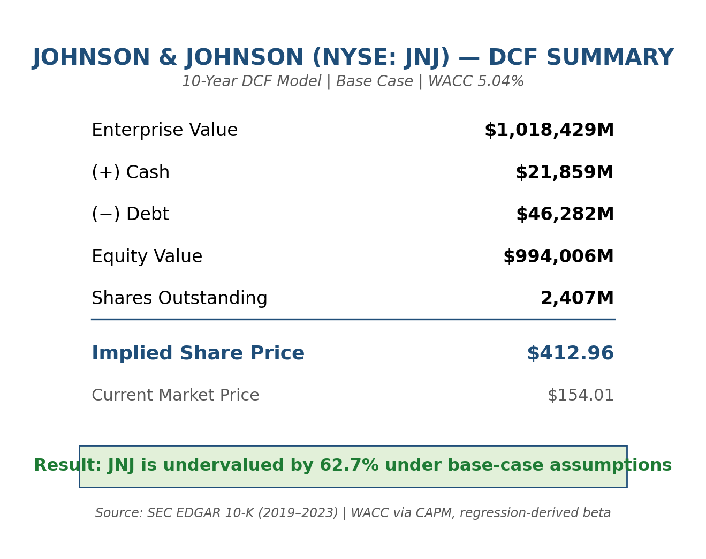

# DCF Valuation — Johnson & Johnson (NYSE: JNJ)

**File:** `Johnson and Johnson FCF Valuation.xlsx`

Built a 10-year discounted cash flow model using 5 years of historical 10-K data (2019–2023, pulled via SEC EDGAR), with revenue, EBIT margin, tax rate, D&A, CapEx, and net working capital all modeled as drivers off of revenue. WACC of 5.04% calculated via CAPM using a regression-derived beta. Three scenarios (conservative, base, optimistic) built into the model via an assumption-switch mechanism.

**Result:** Under base-case assumptions, the model implies a share price of $412.96 against a market price of $154.01 — a 63% undervaluation.

---

*Originally built as part of a 3-person graduate valuation project covering the US healthcare sector (JNJ, UNH, BSX); the JNJ model is my individual work.*

[← Back to FP&A & Financial Modeling](../)
